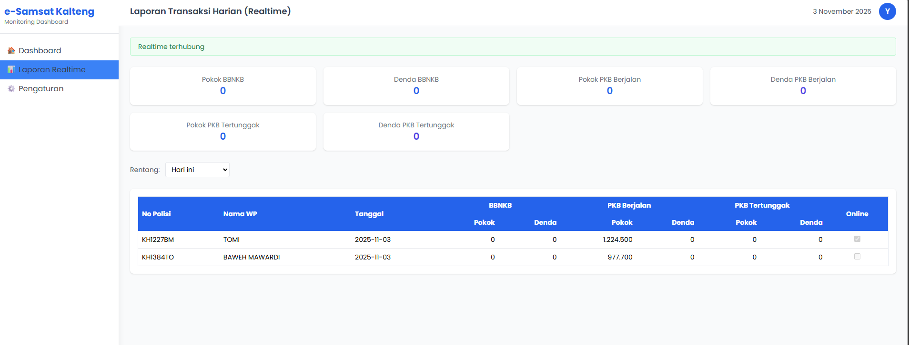

# 🧾 e-Samsat Kalteng — Monitoring Dashboard (Realtime)


**e-Samsat Kalteng Monitoring Dashboard** adalah aplikasi web berbasis **Node.js + Supabase + PostgreSQL** yang digunakan untuk memantau penerimaan pajak kendaraan bermotor secara *realtime* di lingkungan **Bapenda Provinsi Kalimantan Tengah**.

Dashboard ini menampilkan laporan transaksi harian e-Samsat yang langsung tersinkronisasi dengan database Supabase melalui kanal **Supabase Realtime**, sehingga setiap transaksi baru, pembatalan, atau koreksi pembayaran akan langsung muncul tanpa perlu memuat ulang halaman.

---

## 🖼️ Tampilan Dashboard



Dashboard menampilkan laporan harian dengan rekap komponen pokok dan denda pajak kendaraan secara realtime, lengkap dengan status koneksi Realtime Supabase.

---

## 🚀 Fitur Utama

- **📡 Laporan Harian Realtime**
  - Data transaksi otomatis diperbarui saat terjadi *insert*, *update*, atau *delete* di Supabase.
  - Mendukung filter tanggal (*Hari ini*, *Kemarin*, *3 hari terakhir*).
  - Indikator status koneksi realtime aktif / terputus.

- **💰 Rekap Pajak Lengkap**
  - Menampilkan total penerimaan berdasarkan jenis pajak:
    - **BBNKB** — pokok & denda  
    - **PKB Berjalan** — pokok & denda  
    - **PKB Tertunggak** — pokok & denda  
    - *(opsional: SWDKLLJ jika diaktifkan di tabel)*  
  - Semua data berubah realtime saat ada transaksi baru atau penghapusan.

- **🔗 Integrasi Django → Supabase**
  - Backend Django mengirim transaksi baru atau membatalkan pembayaran langsung ke endpoint **Supabase REST API**.
  - Menggunakan **Service Role Key** untuk akses aman dan otorisasi penuh.
  - Mendukung `unique(nomor_polisi, tanggal)` untuk mencegah duplikasi transaksi.

- **🎨 Desain Modern dan Ringan**
  - Dibangun dengan **TailwindCSS**, **EJS partials**, dan **Vanilla JavaScript**.
  - Tampilan responsif dan konsisten seperti dashboard profesional.

- **🧱 Self-Hosted Supabase**
  - Berjalan di jaringan lokal (contoh: `http://192.168.168.100:8000`) menggunakan Docker Compose.
  - Fitur Realtime aktif penuh dengan `REPLICA IDENTITY FULL` untuk event DELETE.

---

## ⚙️ Deskripsi package.json

```json
{
  "name": "esamsat-kalteng-realtime",
  "version": "1.0.0",
  "description": "Realtime monitoring dashboard untuk e-Samsat Kalteng — menampilkan laporan penerimaan PKB, BBNKB, dan SWDKLLJ langsung terhubung dengan Supabase self-host.",
  "main": "app.js",
  "scripts": {
    "start": "node app.js",
    "dev": "nodemon app.js"
  },
  "keywords": [
    "supabase",
    "realtime",
    "dashboard",
    "nodejs",
    "esamsat",
    "bapenda",
    "kalteng"
  ],
  "author": "PT Yuk Code Creative",
  "license": "Private",
  "dependencies": {
    "express": "^4.19.2",
    "ejs": "^3.1.10",
    "@supabase/supabase-js": "^2.45.1"
  },
  "devDependencies": {
    "nodemon": "^3.1.3"
  }
}
```

---

## 🧠 Arsitektur Sistem

```
+-------------+        +--------------------+        +------------------+
|  Django App | <----> |  Supabase REST API | <----> |  PostgreSQL (db) |
| (Payment)   |        |  & Realtime Server |        |  + Publication   |
+-------------+        +--------------------+        +------------------+
          |                        ↑
          |   WebSocket / HTTP     |
          ↓                        |
   +-------------------------+     |
   |  Node.js Dashboard App  | <---+
   |  (Express + EJS + JS)   |
   +-------------------------+
```

---

## ⚙️ Menjalankan Aplikasi

```bash
# 1. Jalankan Supabase (jika belum aktif)
docker compose up -d

# 2. Install dependencies Node.js
npm install

# 3. Jalankan dashboard monitoring
npm start
```

Buka browser ke **http://localhost:3001** untuk melihat dashboard.

---

## 📦 Struktur Proyek

```
project/
├── app.js
├── views/
│   ├── laporan_realtime.ejs
│   └── partials/
│       ├── head.ejs
│       ├── sidebar.ejs
│       └── navbar.ejs
├── public/
│   ├── js/
│   │   └── supabase-realtime.js
│   └── css/
├── docker-compose.yml
└── README.md
```

---

## 🏛️ Lisensi

Proyek ini dikembangkan oleh **PT Yuk Code Creative**  
untuk mendukung sistem digitalisasi pajak kendaraan bermotor di **Bapenda Provinsi Kalimantan Tengah**.  
Lisensi bersifat **private/internal use** kecuali dinyatakan lain.

---

### ✨ Deskripsi singkat

> Realtime monitoring dashboard untuk e-Samsat Kalteng — menampilkan laporan penerimaan PKB, BBNKB, dan SWDKLLJ secara langsung terhubung dengan Supabase self-host.
